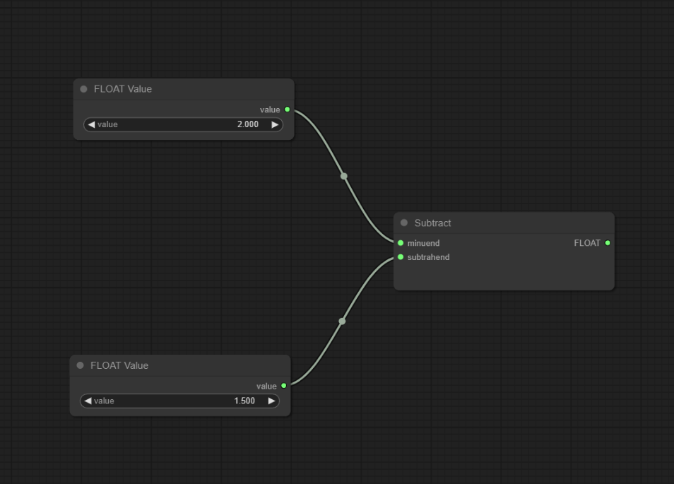

## Introduction
This project presents a robust service for invoking Python nodes, encapsulated with the power of litegraph.js and TypeScript. It seamlessly integrates with ComfyUI, offering a TypeScript implementation that is both efficient and user-friendly.




## Installation and Startup

1. **Install Python Dependencies**: Install the required Python packages from `requirements.txt`.

    ```bash
    pip install -r requirements.txt
    ```

2. **Start the Service**: Launch the service by running the `main.py` script.

    ```bash
    python main.py
    ```

This initializes the Python Node Invocation Service, integrating it with Litegraph.js and TypeScript.


## Features

* [x] Python Node Invocation: Leverage the flexibility of Python within a node-based architecture.
* [x] Litegraph.js Integration: Utilize the dynamic node-graph library for creating complex workflows.
* [x] TypeScript Implementation: Benefit from the strong typing and modern features of TypeScript.
* [ ] ComfyUI Compatibility: Seamlessly integrate with ComfyUI nodes for a cohesive user experience.
